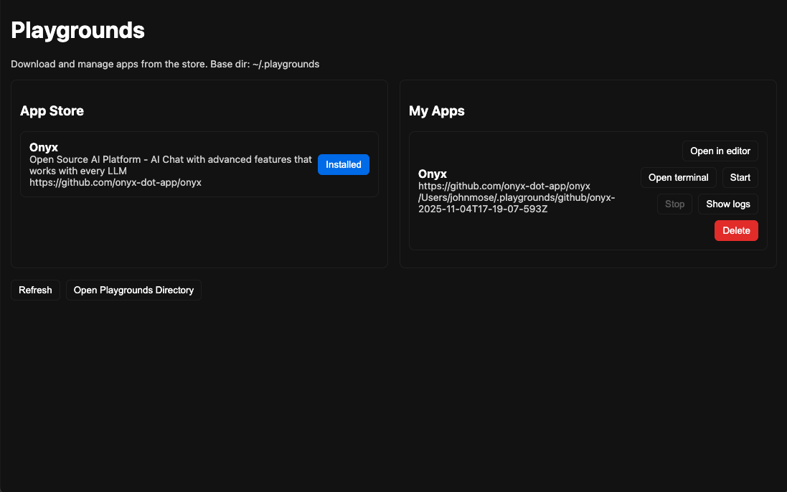
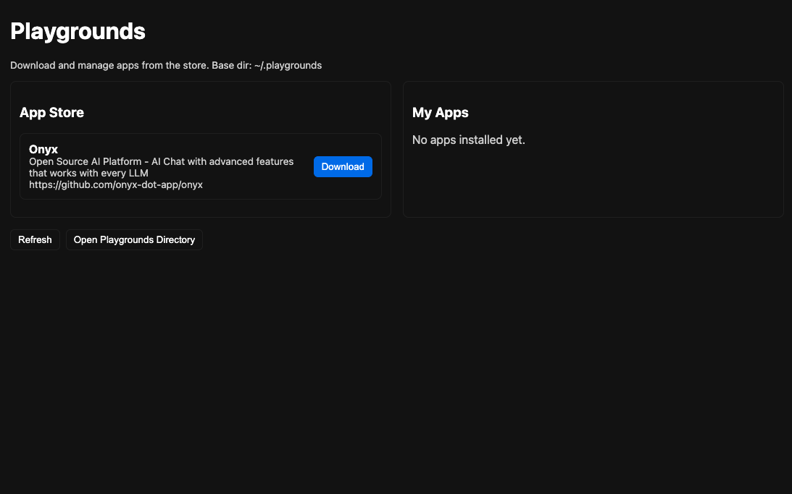

Playgrounds
===========

[](https://opensource.org/licenses/MIT)
[](https://github.com/john-m24/playground)

An App Store-based Electron + TypeScript desktop app to install and manage GitHub repositories as playground environments. Browse curated apps from a catalog, install them with one click, and manage them with built-in tools — without manually running git clone, rm -rf, etc.

## Repository

[GitHub Repository](https://github.com/john-m24/playground)

Features
--------
- App Store
  - Browse curated apps from a catalog (e.g., Onyx)
  - One-click installation of GitHub repositories
  - Apps are pre-configured with default run commands and ports
- Installed Apps Management
  - Open in editor (VS Code if available) with fallbacks for macOS/Windows/Linux
  - Open terminal in playground directory with OS-appropriate terminal
  - Start/Stop dev commands with live log streaming
  - View logs for running processes in real-time
  - Delete apps (removes directory and metadata, executes cleanup commands if configured)
- Easy Cleanup
  - Delete removes playground directory and metadata
  - Apps can include custom delete commands for cleanup (e.g., Docker Compose down)

Note: Docker playgrounds and manual GitHub playground creation are implemented in the backend but not currently exposed in the UI.

Project Structure
-----------------
- `src/common/types.ts` — shared types
- `src/main/` — Electron main process (Node, TypeScript)
  - `index.ts` — window + IPC wiring
  - `playgrounds.ts` — Git/Docker operations, metadata, dev runner
  - `appStore.ts` — App catalog loading and management
  - `apps/` — App catalog JSON files (e.g., `onyx.json`)
  - `utils/shell.ts` — small wrapper for running commands
- `src/preload/` — secure IPC bridge exposed on `window.api`
- `src/renderer/` — React UI
  - `App.tsx` — App Store UI, installed apps management, and log viewer
  - `index.html`, `main.tsx`, `styles.css`

Getting Started
---------------
Prerequisites: Node 18+, git, and (optional) docker must be on PATH.

1. Install dependencies

   - `npm install`

2. Run in development (Electron + Vite)

   - `npm run dev`

3. Build

   - `npm run build`

4. Start built app locally

   - `npm start`

Usage
-----
- **App Store**: Browse available apps in the catalog and click "Download" to install
- **Installed Apps**: Manage your installed apps with:
  - **Open in editor**: Opens the playground directory in VS Code (or fallback editor)
  - **Open terminal**: Opens a terminal in the playground directory
  - **Start**: Runs the dev command (uses catalog `defaultRunCommand`, stored `runCommand`, or heuristic)
  - **Stop**: Stops the running dev process
  - **Show logs**: Displays live logs from the dev process
  - **Delete**: Removes the playground directory and metadata
- **Dev Commands**: Automatically uses the app's configured `defaultRunCommand` from the catalog, falls back to stored `runCommand`, or uses `npm install && npm run dev` heuristic if `package.json` exists

Notes
-----
- Base directory: `~/.playgrounds` (with GitHub clones under `~/.playgrounds/github/<id>`)
- Metadata: `~/.playgrounds/meta.json`
- App Store catalog: Apps are defined in `src/main/apps/*.json` files with metadata like `repoUrl`, `defaultRunCommand`, `defaultPort`, etc.
- Editor detection prefers `code` if available; macOS/Windows/Linux fallbacks are attempted.
- Terminal opening varies by OS/DE; common terminals are attempted on Linux.
- Manual playground creation APIs exist in the backend but are not currently exposed in the UI.

App Store Catalog Format
------------------------
To add apps to the catalog, create JSON files in `src/main/apps/` with the following structure:

- **Required fields**: `id`, `name`, `description`, `repoUrl`
- **Optional fields**: `defaultRunCommand`, `defaultPort`, `deleteCommand`, `requirements`, `setupInstructions`

The `id` must match the filename (without `.json` extension). See `src/main/apps/onyx.json` for an example.

Example:
```json
{
  "id": "my-app",
  "name": "My App",
  "description": "Description of the app",
  "repoUrl": "https://github.com/user/repo",
  "defaultRunCommand": "npm install && npm run dev",
  "defaultPort": 3000,
  "deleteCommand": "docker compose down",
  "requirements": ["git", "docker"],
  "setupInstructions": "Instructions for setting up the app"
}
```

## Screenshots

### Installed Apps Management

*Manage your installed apps with editor, terminal, start/stop, logs, and delete actions*

### App Store View

*Browse available apps from the catalog and install them with one click*

## Contributing

Contributions are welcome! Please read our [Contributing Guide](CONTRIBUTING.md) for details on our code of conduct and the process for submitting pull requests.

## Code of Conduct

This project follows the [Contributor Covenant Code of Conduct](CODE_OF_CONDUCT.md). By participating, you are expected to uphold this code.

## License

This project is licensed under the MIT License - see the [LICENSE](LICENSE) file for details.

